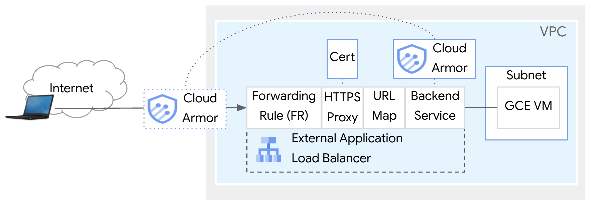

# External Application Load Balancer with Cloud Armor

This repo contains instructions and a Terraform script to build an External Application Load Balancer and Cloud Armor in an isolated Google Cloud environment.

**Architecture**


## Notes
* The intent of this repo is to create a fixed, isolated environment for learning, demonstration and Proof of Concept (PoC), **not production**.
* The actions taken by deploying this repo will add cost. To minimize costs, instructions are provided for how to teardown the demo environment when you're finished using it. For more on cost, please refer to Google Cloud public pricing pages for components such as External Load Balancers, Reserved IP Addresses, Data Transfer, Certificate Manager, Cloud Armor, etc.
* Org policies must be set for the script to run (see Prerequisites below). The script may not be appropriate for highly regulated environments. 


## Prerequisites
1. Make sure the following tools are available in your terminal's $PATH ([Cloud Shell](https://cloud.google.com/shell/docs/how-cloud-shell-works) has these preconfigured)
    * [gcloud CLI SDK](https://cloud.google.com/sdk/docs/install)
    * terraform
2. Must be using Terraform **version 1.10 or above**. Run the `terraform --version` command to verify version. If needed, upgrade instructions here: https://www.tecmint.com/install-terraform-in-linux/
3. Project-level permissions needed to run the script:\
   a. Permission: . Role: 
4. Org-level permissions needed to run the script:
5. The following [Google Cloud org policies](https://cloud.google.com/resource-manager/docs/organization-policy/using-constraints) must be set for the script to run:
    * constraints/compute.requireShieldedVm
    * disableInternetNetworkEndpointGroup at the project level, and sets to "allow all" for org policies trustedImageProjects and restrictVpnPeerIPs at the project level, so .


## Setup and Deploy the script

To deploy the script, follow this process:
1. Create a project in GCP, if not already created. Reference if needed [Creating and managing projects](https://cloud.google.com/resource-manager/docs/creating-managing-projects)
      * Create a VPC and subnet in the project
      * Create a GCE VM in the subnet
      * Setup Cloud NAT for the VM using these commands:
      * Load nginx on the VM using this command: 
2. Clone the this repo using the tool of your choice, eg CLI on your machine, [Cloud Shell](https://cloud.google.com/shell/docs/how-cloud-shell-works), VS Code, etc.
```sh
git clone https://github.com/kurtradecki/gcp-xalb-cldarmr-demo.git
```
3. Ensure you have an active GCP account selected to run gcloud commands with [gcloud CLI SDK](https://cloud.google.com/sdk/docs/install) (not needed in [Cloud Shell](https://cloud.google.com/shell/docs/how-cloud-shell-works)).
```sh
gcloud auth login
gcloud auth application-default login
```
4. In the gcp-xalb-cldarmr-demo directory, rename example.tfvars to terraform.tfvars
5. Get your public IP for the terraform.tfvars file. Sites like https://whatismyipaddress.com/ show your public IP.
6. In terraform.tfvars, add the values for variables that need values (see the file for which). All other values can stay the same unless customization required. Reference if needed for how to find project ID, see [Find the project name, number, and ID](https://cloud.google.com/resource-manager/docs/creating-managing-projects#identifying_projects)
7. At the command prompt where you'll run the script, in the Terraform directory, run:
```sh 
terraform init
terraform plan
terraform apply -auto-approve
```
8. Wait a few minutes for the script to complete (setting Looker custom domain takes 10-15 minutes). You'll see a message similar to "Apply complete!" and then move to the next section.\


## Troubleshooting

**Terraform script errors**\
Most errors in this Terraform script can be cleared by running the `terraform plan` and `terraform apply -auto-approve` again. 

**Cert for External application load balancer**\
It can take 24 hours for the certificate to move to Status of ACTIVE. From testing, it is usually much faster, less than 1 hour. If you see Statuses such as FAILED_NOT_VISIBLE or PROVISIONING, the certificate needs more time to validate. See [Domain status](https://cloud.google.com/load-balancing/docs/ssl-certificates/troubleshooting#domain-status) for more information. 

Go to Network Services > Load Balancing and select your apigee load balancer(s). In the Frontend section, click the link under the heading "Certificate". Verify that the cert in the load balancer is Status of ACTIVE. See images in Step 4 of [Validated TLS Cert Made Simpler: Testing Google Cloud External Load Balancers Without Owning a Domain](https://medium.com/google-cloud/validated-tls-cert-made-simpler-testing-google-cloud-external-load-balancers-without-owning-a-d5a972bac3b2) for how an ACTIVE cert should look. Once it is ACTIVE, find the domain which is based on a public IP address created in the script and enter it in a web browser. It will be in the form of #-#-#-#.nip.io. 

Note that there can be a delay (~5 mins) between a cert going ACTIVE and when you get a successful reply. A successful reply will show something like this:


## Conclusion & Cleanup

Congratulations! You've successfully deployed the script.

To delete the created infrastructure, run the following command:

```sh
terraform destroy -auto-approve
```

Wait a few minutes for the components created by the Terraform script to be removed. You'll see a message similar to "Destroy complete!" 
